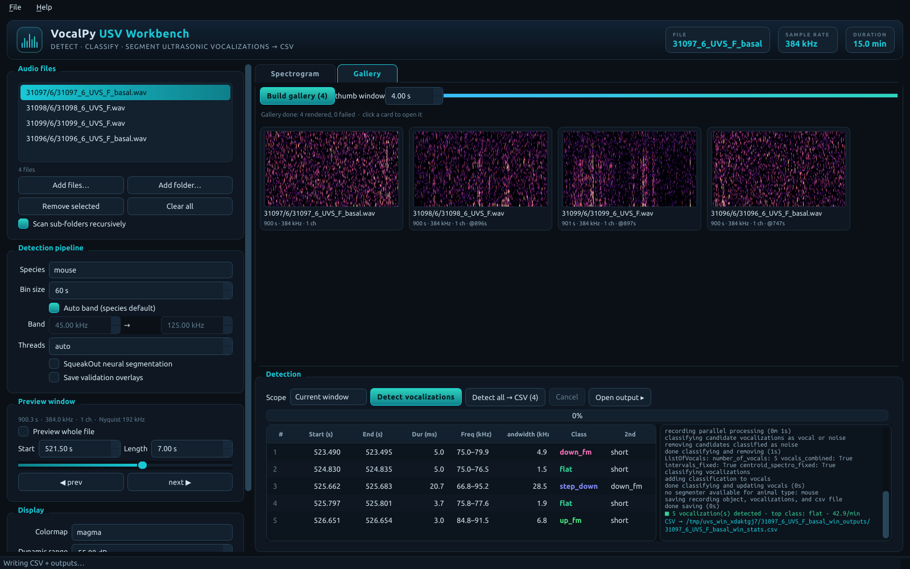
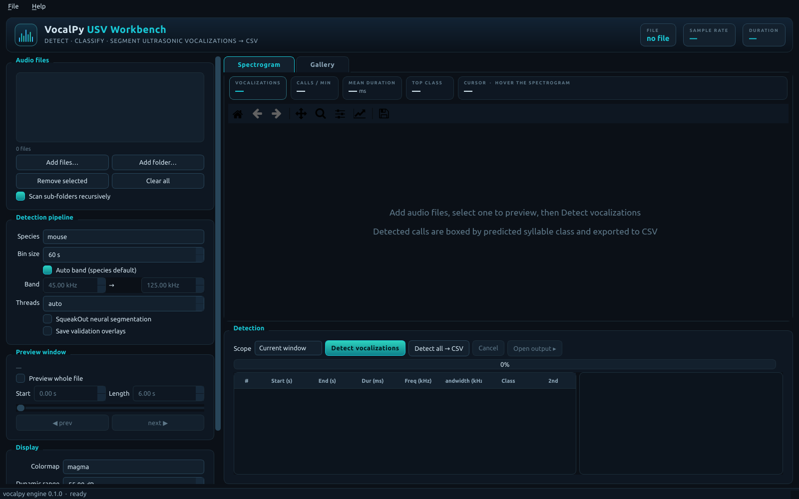

# 🐭🔊 VocalPy USV Workbench

A dark "scientific workstation" desktop app (PySide6) that **detects, classifies,
and segments animal ultrasonic vocalizations (USVs)** and exports a **per-file CSV**,
built on the [`gumadeiras/vocalpy`](https://github.com/gumadeiras/vocalpy) engine
(inspired by [VocalMat](https://github.com/ahof1704/VocalMat)).

Point it at 384 kHz mouse / rat / guinea-pig recordings, preview a band-limited
spectrogram, run the full detect → classify → (segment) pipeline, and inspect every
call as a class-colored box overlay + a results table, then export the stats CSV.


> Real data above: female-mouse USVs (`31097_6_UVS_F`). Five calls detected in a
> 7 s window; each box is colored by its predicted syllable class (`down_fm`, `flat`,
> `step_down`, `up_fm`), the tiles summarize the detection, the cursor reads out
> `time · frequency · power`, and the table + `*_stats.csv` carry the exact numbers.

---

## ✨ What it does

### 🎯 Real USV detection, not just a spectrogram
Each file runs the upstream pipeline: chunk the audio → spectrogram-based candidate
detection (adaptive threshold + morphology) → a MobileNetV2 **noise filter** removes
false positives → an **11-class syllable classifier** (`chevron`, `complex`, `down_fm`,
`flat`, `mult_steps`, `rev_chevron`, `short`, `step_down`, `step_up`, `two_steps`,
`up_fm`) labels each call → optional **SqueakOut** neural segmentation masks.

### 📄 A CSV for every file
Results are written to `{name}_outputs/{name}_stats.csv` next to the audio (exactly
like the upstream tool), one row per vocalization:

```
bin_number, start(s), end(s), duration(ms), interval(s), min_freq, max_freq,
avg_freq, bandwidth, min_intensity, max_intensity, avg_intensity, bg_intensity,
area(pixels), centroid_y, class_top1, class_top2
```

### 🖍️ See every call, inspect every number
Detected calls are boxed on the spectrogram and colored by class. The **results
table** lists start/end, duration, frequency range, bandwidth, and top-2 classes;
click a row to jump the preview to that call. Live **tiles** show the count,
calls/minute, mean duration, and dominant class. Hover anywhere for an exact
`time · frequency · power-over-background` readout.

### 🖼️ A gallery that finds the calls for you
`Build gallery` renders a thumbnail per file, each **auto-seeking the most vocal
window** in that recording (not its silent start). Click a card to open it.



### 🐘 Built for long, high-rate recordings
384 kHz / 15-minute files are never loaded whole for preview: only the visible
window is read and displayed with the same band-limited spectrogram the detector
uses. Detection runs on a background thread with progress; the **Current window**
scope gives fast, interactive detection while **Whole file** / **Detect all** run the
full analysis and write the official CSVs.

---

## 🚀 Quickstart

Requires **Python 3.12** and **Git LFS** (the pretrained model checkpoints are stored
via LFS). A conda env is created from `environment.yaml`:

```bash
cd vocalpy_gui
conda env create -f environment.yaml          # creates the `UVS` env (torch CPU, etc.)
conda activate UVS

git -C vocalpy_engine lfs pull                 # fetch the model checkpoints (~84 MB)
pip install -e ./vocalpy_engine --no-deps      # vendored gumadeiras/vocalpy engine
pip install -e . --no-deps                     # this app → vocalpy-gui / vocalpy-cli

vocalpy-gui                                    # launch the workbench
```

No install? `python run_vocalpy_gui.py` (it adds `vocalpy_engine/` to the path).

Then: **Add folder…** → pick recordings → select one → **Detect vocalizations**
(scope *Current window* to explore, *Whole file* for the official CSV) →
**Detect all → CSV** to batch the whole list.



---

## 💻 Command line

Same engine as the GUI; writes one CSV per file.

```bash
conda activate UVS

# one file (mouse)
vocalpy-cli /path/to/recording.wav

# a whole folder (recurses), rat pipeline, with SqueakOut segmentation
vocalpy-cli /path/to/folder -a rat --segmenter

# no install
python run_vocalpy_cli.py ../dataset/31097/6/31097_6_UVS_F_basal.wav
```

Options: `-a/--animal {mouse,rat,guineapig}`, `-b/--bin-size`, `-lf/--lower-freq`,
`-hf/--higher-freq` (Hz), `-t/--threads`, `--segmenter`, `-l/--validation`,
`--no-recursive`. Run `vocalpy-cli -h` for details. The vendored engine also ships
its own `vocalpy` command (see `vocalpy_engine/README.md`).

---

## 🧩 Layout

```
vocalpy_gui/
├── vpgui/                  # this application (GUI + CLI front-end)
│   ├── theme.py            # palette + global QSS (dark #0b1017 / cyan-teal, gradients)
│   ├── engine.py           # adapter over the vendored vocalpy detection pipeline
│   ├── spectro.py          # audio discovery + engine-consistent display spectrograms
│   ├── plotting.py         # matplotlib rendering + class-colored detection overlays
│   ├── workers.py          # QThread workers (preview, detect, batch-detect, gallery)
│   ├── widgets.py          # metric tiles + interactive spectrogram canvas (crosshair)
│   ├── results.py          # detections table (class-colored, clickable rows)
│   ├── gallery.py          # reflowing grid of clickable thumbnail cards
│   └── app.py              # MainWindow + main()
├── vocalpy_engine/         # vendored gumadeiras/vocalpy (the detection engine + models)
├── environment.yaml        # the `UVS` conda environment (torch CPU + full stack)
├── run_vocalpy_gui.py      # no-install launcher
├── run_vocalpy_cli.py      # no-install CLI launcher
├── pyproject.toml          # `vocalpy-gui` / `vocalpy-cli` entry points
├── GUI.md                  # visual + workflow design contract
└── README.md
```

## 🔧 Notes

- **Species presets** set the analysis band automatically (mouse 45–125 kHz, rat
  18–125 kHz, guinea pig 0.25–20 kHz); untick *Auto band* to override.
- **Denoise** (display only) subtracts each frequency's stationary background so
  calls pop; it never affects detection or the CSV.
- Detection needs numpy/scipy/opencv/scikit-image; **classification + SqueakOut**
  additionally need torch/torchvision and the LFS checkpoints under
  `vocalpy_engine/vocalpy/nn/pretrained/`.
