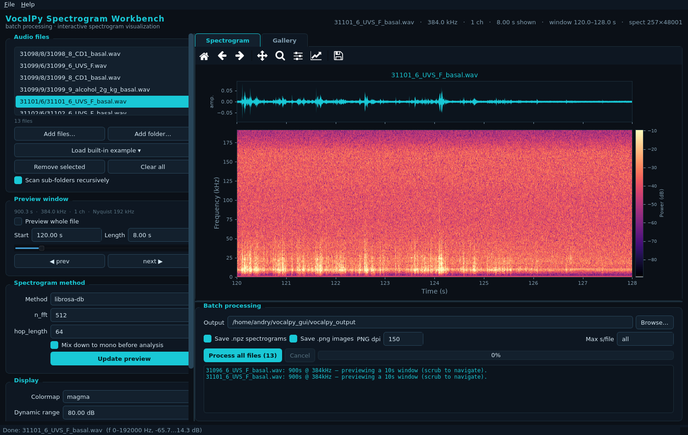

# VocalPy Spectrogram Workbench

A dark "scientific workstation" desktop app (PySide6) for **batch spectrogram
processing** and **interactive spectrogram visualization**, built on
[VocalPy](https://github.com/vocalpy/vocalpy) — a core package for acoustic
communication research in Python.



## What it does

- **Load a folder** (recursively scanning sub-folders) of audio files (`.wav`,
  `.flac`, `.ogg`, `.aiff`, `.cbin`, …), or add individual files / built-in VocalPy
  example clips. Files are listed by path relative to their common ancestor.
- **Visualize results in a gallery** — one click renders a spectrogram thumbnail for
  every file in a reflowing grid of cards (with duration / sample-rate / channels);
  click any card to open it in the interactive view.
- Preview spectrograms interactively with three VocalPy backends
  (`librosa-db`, `sat-multitaper`, `soundsig-spectro`), tuning compute params
  (`n_fft`, `hop_length`, soundsig params) and display options (colormap, dynamic
  range, frequency limits, waveform) live.
- **Built for long, high-rate USV recordings** (e.g. 384 kHz, 15 min, ~700 MB): it
  previews a *window* of the file (scrub / prev / next through the recording on an
  absolute-time axis) instead of loading the whole thing, with a memory guard.
- Batch-process the whole list into `.npz` spectrograms (`vocalpy.Spectrogram`)
  and/or `.png` images, with an optional per-file second cap, progress, cancellation,
  and a per-file log.

## Install

Requires Python 3.12 (VocalPy 0.11.0 needs >=3.12). A conda env is recommended.

```bash
conda create -y -n vocalpy python=3.12 pip
conda activate vocalpy
pip install -e .                # installs this app + vocalpy 0.11.0 + PySide6 + matplotlib
```

`pip install -e .` provides the `vocalpy-gui` command and pulls the runtime
dependencies (see `pyproject.toml`). To pin the exact set instead, use
`pip install -r requirements.txt`.

> The three VocalPy 0.11.0 quirks noted below are worked around inside `vpgui`, so a
> stock `pip`-installed `vocalpy==0.11.0` works. No fork of VocalPy is required.

## Run

```bash
conda activate vocalpy
vocalpy-gui                      # if installed with `pip install -e .`
# or, with no install:
python run_vocalpy_gui.py
# or:
python -m vpgui
```

Headless GUI smoke tests:

```bash
QT_QPA_PLATFORM=offscreen python run_vocalpy_gui.py   # constructs and exits via your own harness
```

## Layout

```
vocalpy_gui/                # (MiMic repo root)
├── vpgui/                  # this application
│   ├── theme.py            # palette + global QSS (dark #0b1017 / cyan-teal)
│   ├── spectro.py          # pure vocalpy logic (discovery, load, dispatch)
│   ├── plotting.py         # matplotlib Figure rendering (thread-safe, no pyplot)
│   ├── workers.py          # QThread workers (preview + batch)
│   ├── widgets.py          # embedded canvas + navigation toolbar
│   └── app.py              # MainWindow + main()
├── run_vocalpy_gui.py      # no-install launcher
├── pyproject.toml          # `vocalpy-gui` entry point
├── GUI.md                  # visual + workflow design contract
└── README.md
```

## Notes

`soundsig-spectro` is dispatched directly (pre-scaled to int16, `scale=False`) to
work around two real bugs in vocalpy 0.11.0 (`voc.spectrogram` mis-forwarding
`n_fft`/`hop_length`, and `soundsig_spectro(scale=True)` referencing a missing
`Sound.path`). See `vpgui/spectro.py` for details.
